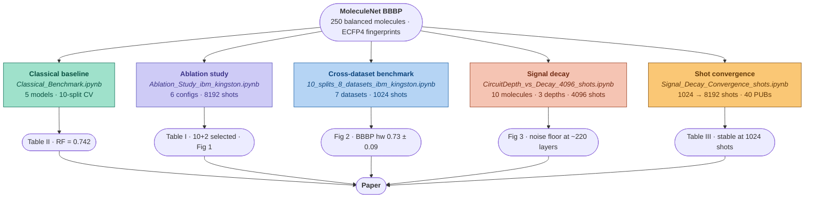

# Quantum Feature Mapping for Molecular Classification
### Evaluating Exponential Expressivity in NISQ Hardware

**Abdul Hannan · Maral Mahmoudi Kamelabad · Anna Kazakova Lindegren · Robert Loredo**

> Submitted to IEEE. This repository contains all experimental notebooks used to produce the results, figures, and tables in the paper.

---

## Overview

This work introduces the **10+2 Structure-Preserving Quantum Feature Map** — a fixed-width 12-qubit encoding designed for NISQ-compatible molecular classification. Ten qubits encode the molecular graph backbone via Ry rotations (Pauling electronegativity) and Rxx entangling gates (bond order), while two auxiliary qubits compress the remaining atomic tail. The resulting 4,096-dimensional probability vector is passed to an RBF-kernel SVM for classification.

The framework is evaluated on MoleculeNet's BBBP benchmark and six additional datasets using the **ibm_kingston** quantum processor via IBM Quantum, with 10-split stratified cross-validation throughout.

---

## Repository Structure

```
.
├── Classical_Benchmark.ipynb
├── Ablation_Study_ibm_kingston_8192_shots.ipynb
├── Copy_of_Ablation_Study_New_8192_shots.ipynb
├── 10_splits_8_datasets_experiment_ibm_kingston.ipynb
├── CircuitDepth_vs_Decay_4096_shots.ipynb
├── Signal_Decay_Convergence_shots_1024_2048_4096_8192.ipynb
└── README.md
```

---

## Notebooks

### 1. `Classical_Benchmark.ipynb`
**Corresponds to:** Table II — *Classical Baseline Comparison*

Establishes the classical performance ceiling on 250 balanced BBBP molecules (125 permeable, 125 non-permeable). Uses 256-bit radius-2 Morgan Fingerprints (ECFP4) as features. Evaluates five classifiers across 10-split stratified shuffle-split cross-validation.

| Model | Accuracy | AUC-ROC |
|---|---|---|
| Random Forest | 0.742 ± 0.052 | 0.801 ± 0.056 |
| SVM (RBF Kernel) | 0.710 ± 0.043 | 0.797 ± 0.048 |
| Gradient Boosting | 0.692 ± 0.063 | 0.748 ± 0.067 |
| Logistic Regression | 0.692 ± 0.053 | 0.760 ± 0.033 |
| SVM (Linear) | 0.682 ± 0.045 | 0.740 ± 0.037 |

Random Forest is adopted as the primary classical baseline throughout the paper.

---

### 2. `Ablation_Study_ibm_kingston_8192_shots.ipynb`:** Table I — *Hardware Ablation Configuration vs. Accuracy* and Section IV-B — *Primary Classification Performance*

Both notebooks are identical runs of the same ablation experiment (the Copy is a verified duplicate confirming reproducibility). Each cell tests one of six Ncore+Mtail qubit configurations on ibm_kingston at 8,192 shots across 10 splits on the BBBP dataset.

| Configuration | Total Qubits | Hardware Accuracy |
|---|---|---|
| 8+2 | 10 | 0.76 ± 0.07 |
| 8+4 | 12 | 0.71 ± 0.07 |
| **10+2** | **12** | **0.75 ± 0.07** |
| 10+4 | 14 | 0.71 ± 0.05 |
| 12+2 | 14 | 0.74 ± 0.08 |
| 12+4 | 16 | 0.67 ± 0.05 |

The **10+2 configuration** is selected as the primary architecture for its optimal balance of structural fidelity and coherence budget.

---

### 3. `10_splits_7_datasets_experiment_ibm_kingston.ipynb`
**Corresponds to:** Figure 2 — *Cross-Dataset Accuracy Benchmark* and Section IV-C

Benchmarks the 10+2 quantum feature map against Classical RF and the noiseless simulator across **seven MoleculeNet datasets** (BBBP, Tox21, BACE, HIV, ESOL, Lipophilicity, FreeSolv) using 1,024 shots on ibm_kingston. Each dataset uses the same balanced 250-molecule protocol.

Key results (Quantum Hardware vs. Classical RF accuracy):

| Dataset | Hardware | Classical RF |
|---|---|---|
| BBBP | 0.73 ± 0.09 | 0.71 ± 0.05 |
| Tox21 | 0.58 ± 0.10 | 0.64 ± 0.06 |
| BACE | 0.62 ± 0.08 | 0.80 ± 0.07 |
| HIV | 0.52 ± 0.06 | 0.58 ± 0.06 |
| ESOL | 0.67 ± 0.05 | 0.76 ± 0.05 |
| Lipophilicity | 0.56 ± 0.08 | 0.58 ± 0.06 |
| FreeSolv | 0.61 ± 0.07 | 0.80 ± 0.04 |

---

### 4. `CircuitDepth_vs_Decay_4096_shots.ipynb`
**Corresponds to:** Figure 3 — *Circuit Depth vs. Peak Basis State Probability* and Section IV-E

Measures signal fidelity (peak basis state probability) for 10 diverse molecules across three transpiled circuit depth configurations — Shallow (~5 layers), Normal/10+2 (~105 layers), and Deep (~220 layers) — using 4,096 shots on ibm_kingston in a single batch job.

Key findings:
- At ~105 layers, all molecules remain measurably above the theoretical noise floor (1/2¹² ≈ 0.0002), ranging from **0.009** (Caffeine) to **0.298** (Benzene)
- At ~220 layers, most molecules collapse to near-noise-floor, with Urea (**0.139**) and Glycerol (**0.044**) as notable exceptions

---

### 5. `Signal_Decay_Convergence_shots_1024_2048_4096_8192.ipynb`
**Corresponds to:** Table III — *Measurement Convergence: Max State Probability vs. Shot Budget* and Section IV-F

Sweeps shot budgets from 1,024 to 8,192 on the same 10 molecules using the 10+2 circuit on ibm_kingston (single batch of 40 PUBs), producing the convergence matrix showing that signal fidelity stabilizes at 1,024 shots.

| Molecule | 1024 | 2048 | 4096 | 8192 |
|---|---|---|---|---|
| Benzene | 0.3408 | 0.3257 | 0.3313 | 0.3296 |
| Urea | 0.2002 | 0.1919 | 0.1882 | 0.1958 |
| Glycerol | 0.1104 | 0.1201 | 0.1101 | 0.1185 |
| Caffeine | 0.0098 | 0.0112 | 0.0071 | 0.0066 |

---

## Experiment Map


 

---

## Hardware & Software

**Quantum Hardware:** IBM Quantum ibm_kingston (Heron r2 processor)
Additional backends used for primary classification comparison: ibm_fez, ibm_marrakesh

**Key Dependencies:**
```
qiskit >= 2.3.1
qiskit-ibm-runtime >= 0.45.1
qiskit-aer >= 0.17.2
qiskit-algorithms == 0.4.0
rdkit
scikit-learn
pandas
numpy
matplotlib
seaborn
```

Install all dependencies:
```bash
pip install qiskit qiskit-ibm-runtime qiskit-algorithms qiskit-aer pylatexenc
pip install pandas scikit-learn matplotlib seaborn rdkit
```

**IBM Quantum Access:** Notebooks require a valid IBM Quantum account. Results from hardware jobs are already stored in notebook outputs and can be inspected without re-running. To re-run hardware jobs, set your credentials via `QiskitRuntimeService.save_account(...)`.

---

## Reproducibility Notes

- All hardware experiments were run as independent job submissions on ibm_kingston. Run-to-run variance is expected on NISQ hardware and is reflected in the confidence intervals reported throughout the paper.
- The two ablation notebooks (`Ablation_Study` and `Copy_of_Ablation_Study`) are duplicate runs of the same experiment, confirming reproducibility across independent executions.
- The `Classical_Benchmark.ipynb` is fully reproducible locally without any quantum hardware access.
- All datasets are sourced from MoleculeNet via the DeepChem S3 bucket and balanced to exactly 250 molecules (125 per class) via random undersampling with `random_state=42`.

---

## Citation

If you use this code or results in your work, please cite.


---

## Acknowledgements

The authors thank the QAMP 2025 organizers and IBM Quantum for providing access to quantum hardware.
